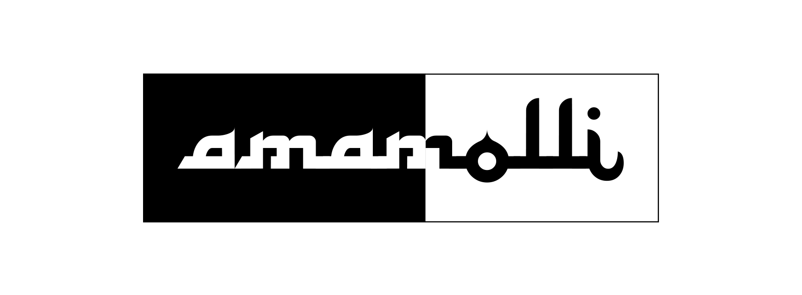

# Aman Molli Webpage

Aman Molli is an open collective workshop/course for eastern Med music.

We hold open practice sessions of east Mediterranean music, in which we play genres such as rebetiko and Greek/Balkan/Turkish/Middle Eastern folk music. 

Together we explore the melodic pathways, rhythms (e.g. 9/8, 7/8. 5/4) and harmonies of, as well as connections between these musical traditions. 

We gather to have fun playing music together, to share musical knowledge and experience, and improve our skills on our instruments. 

We welcome interested newcomers to join in, regardless of musical experience, and using any kind of instrument (strings, percussion, wind, voice). 

Information about upcoming sessions can be found [here](!https://radar.squat.net/en/aman-molli)
